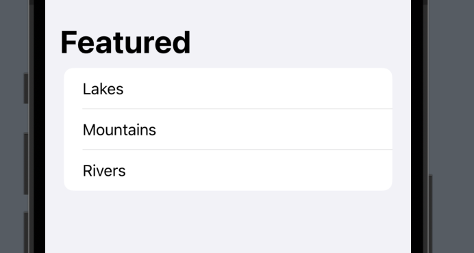

# Landmarks UI App

Playing with SwiftUI with IOS, was able to create this basic Map View:


This is part of the tutorial from this site here: [Landmarks UI](https://developer.apple.com/tutorials/swiftui/creating-and-combining-views)

## Some important concepts to remember (more for myself)

- Swift UI uses the `App` protocol
- Clicking + Command Key on an item can give a special context menu

- The Assets.xcassets is where you can import resources like images for your project

- What the hell is a @State attribute? Example:

```Swift
@State private var region = MKCoordinateRegion(
        center: CLLocationCoordinate2D(latitude: 34.011_286, longitude: -116.166_868),
        span: MKCoordinateSpan(latitudeDelta: 0.2, longitudeDelta: 0.2)
    )
```

- So @State is this:

> @State is a property wrapper that allows you to declare a property whose value can change over time, and when the value changes, the user interface that uses this value will automatically be updated to reflect the change.

```Swift
    // Using @State allows the user interface and this 
    // region variable to updated as changes are made. 
    // This makes it so the user can interact with the map
    
    // We also set a default for the 
    // region location using MKCoordinateRegion 
    // and setting the center and span
    @State private var region = MKCoordinateRegion(
            center: CLLocationCoordinate2D(latitude: 34.011_286, longitude: -116.166_868),
            span: MKCoordinateSpan(latitudeDelta: 0.2, longitudeDelta: 0.2)
        )
```

Looks like Apple Dev says State as the [following](https://developer.apple.com/documentation/swiftui/state):
> Use state as the single source of truth for a given value type that you store in a view hierarchy. Create a state value in an App, Scene, or View by applying the @State attribute to a property declaration and providing an initial value. Declare state as private to prevent setting it in a memberwise initializer, which can conflict with the storage management that SwiftUI provides:

```Swift
struct PlayButton: View {
    @State private var isPlaying: Bool = false // Create the state.


    var body: some View {
        Button(isPlaying ? "Pause" : "Play") { // Read the state.
            isPlaying.toggle() // Write the state.
        }
    }
}
```


- The map view can automatically set the width when you set the height

- Man swift is an interesting language, so unlike Python, if you want call the parameter you want to set when calling a method/function, you can just pass in that value, but in Swift, you can explicitly tell a function you create that you don't want to pass the parameter name, and just pass in the value instead.
`In Swift, you can use an underscore to omit the external parameter names for a function or method. This concept is widely used in iOS applications. For example, if you have a function like this −`

```Swift
func doSomething(_ value: Int) {
   // do something with the value
}

func greetingMessage(_ fullName: String) -> String? {
   return "Good morning, \(fullName)"
}
```

Other wise you would need to declare the "value" attribute, or in the second example above, the `fullName` attribute when calling the greetingMessage function like so:

```Swift
greetingMessage(fullName: "Alex Murphy")
```

- Decodable protocol in Swift is a way to basically to read JSON data from a file or source into your code. Most common ways is to use a structure. In the example below, we have JSON and then our Swift Code:

```JSON
{
"title": "Optionals in Swift explained: 5 things you should know",
"url": "https://www.avanderlee.com/swift/optionals-in-swift-explained-5-things-you-should-know/",
"category": "swift",
"views": 47093
}
```

```Swift
struct BlogPost: Decodable {
    enum Category: String, Decodable {
        case swift, combine, debugging, xcode
    }

    let title: String
    let url: URL
    let category: Category
    let views: Int
}

let JSON = """
{
    "title": "Optionals in Swift explained: 5 things you should know",
    "url": "https://www.avanderlee.com/swift/optionals-in-swift-explained-5-things-you-should-know/",
    "category": "swift",
    "views": 47093
}
"""

let jsonData = JSON.data(using: .utf8)!
let blogPost: BlogPost = try! JSONDecoder().decode(BlogPost.self, from: jsonData)

print(blogPost.title) // Prints: "Optionals in Swift explained: 5 things you should know"
```

- In Swift to pass a variable into a sentence you do:

```Swift
"Hello there \(username)"
```

- Initializing a function like this below can let you ensure that the type you are passing into conforms to the Decodable protocol. You can then later use the type as part of the error logging when catching errors. Notice `T.self` below

```Swift
func load<T: Decodable>(_ filename: String) -> T { ...

do {
    something
    } catch {
        fatalError("Could not decode \(filename) as \(T.self): \(error)")
    }
```

- Depending where you put a `Spacer()` in your stacks, you can make it literally push all your content to a certain side:


- You can actually customize how previews are dispalyed in your code according to [Apple](https://developer.apple.com/tutorials/swiftui/building-lists-and-navigation#Customize-the-Row-Preview):

> Xcode’s canvas automatically recognizes and displays any type in the current editor that conforms to the PreviewProvider protocol. A preview provider returns one or more views, with options to configure the size and device. You can customize the returned content from a preview provider to render exactly the previews that are most helpful to you.

- `some View` lets you tell Swift that you can return basically anything (because your views can be complex) but still basically return a View. It's an "opaque return"

```Swift
struct LandmarkList: View {
    var body: some View {
        do something
        }
    }
}
```

- You can iterate through lists, but you also need to pass it unique iterable identification (such as a id variable) if it is not already adhering to the Identifiable protocol. If you set a structure to adhere to the Identifiable protocol, then you don't need to set the id parameter for the `List()` method. Also below are closures are closures, you basically tell how each iterable item in a list can be used. It is like a for loop. Basically closures are another name for lambda expressions:

```Swift
// Adhering your structure to the Identifiable protocol
struct Landmark: Hashable, Codable, Identifiable {
    
    var id: Int
    ...
```

```Swift
// closures
{ this_iterable in 
    do something
}
```

```Swift

// Leveraging the List method and not having to pass in the id: attribute
struct LandmarkList: View {
    var body: some View {
        List(landmarks) { landmark in
            LandmarkRow(landmark: landmark)
        }
        // Otherwise you would need to do List(landmarks, id: \.id) 
    }
}
```

- A binding in swift is denoted by `$` like `$region` variable. This is used to make a two way directional variable the gets updated by user interactions:

> The Map view takes a coordinateRegion parameter that requires a `Binding<MKCoordinateRegion>`. By using $region, you're passing a binding to the coordinateRegion parameter, allowing the map to update its region based on changes to the region property. Similarly, if the map's region changes due to user interactions, the region property will automatically be updated. In essence, using $region establishes a dynamic link between the region property (which is marked as @State and thus can change) and the map's coordinateRegion, ensuring that changes in one are immediately reflected in the other.

```Swift
// Here we declare the view and make a binding (two way connection
    // for region
    
    var body: some View {
        Map(coordinateRegion: $region)
    }
```

- You can use `Scroll View` Container to allow a user to scroll on a screen

```Swift

    ...
    ScrollView {
        MapView(coordinate: landmark.locationCoordinate)
            .ignoresSafeArea(edges: .top)
            .frame(height: 300)
    
    ...

```

- Below is an example of how in your Detail view you can set .navigationTitle() to something. This can only be actually viewed though when your Detail is part of a Navigation Context

```Swift
struct LandmarkDetail: View {
    var landmark: Landmark
    
    var body: some View {
        
        ScrollView {
           // view stuff
        }
        .navigationTitle(landmark.name) // This here
        .navigationBarTitleDisplayMode(.inline)
    }
}
```

- And then look at the top navigation here, we are calling LandMark Detail. So within a view we can actually set methods related to navigation when its in the context of a navigation.

```Swift
NavigationView {
            List(landmarks) { landmark in
                NavigationLink {
                    LandmarkDetail(landmark: landmark)
                } label: {
                    LandmarkRow(landmark: landmark)
                }
                
            }
            .navigationTitle("Landmarks")
        }
```


- Always create a @State as private

>Because you use state properties to hold information that’s specific to a view and its subviews, you always create state as private.

- You can add `Toggle()` to create a sliding button

```Swift
List {
    Toggle(isOn: $showFavoritesOnly) {
        Text("Favorites only")
    }
    ...
```


- A definition on Observable Objects:

> An observable object is a custom object for your data that can be bound to a view from storage in SwiftUI’s environment. SwiftUI watches for any changes to observable objects that could affect a view, and displays the correct version of the view after a change.

Basically if the data changes in an observable object, the view will change. It is like a binding.

So when you want some data that could change to be reflected in a view, you can use the ObservableObject Protocol attached to a class, and then used @Published on a variable so that your app can know that whenever changes are made, that variable will be used to look for changes, and persist those changes

- Some More info on the @Published var: https://www.hackingwithswift.com/quick-start/swiftui/what-is-the-published-property-wrapper

```Swift
final class ModelData: ObservableObject {
    @Published var landmarks: [Landmark] = load("landmarkData.json")
    
}
```

- This is getting hard to understand, so:

> .environmentObject(modelData): This modifier is applied to the ContentView and injects the modelData instance into the environment of the view hierarchy. This means that any view within the ContentView hierarchy can access the modelData instance without needing to pass it explicitly.

```Swift
import SwiftUI

@main
struct LandmarksApp: App {
    
    @StateObject private var modelData = ModelData()
    
    var body: some Scene {
        WindowGroup {
            ContentView()
                .environmentObject(modelData)
        }
    }
}

```

So essentially above, every view that is in the heirarchy of `ContentView()` will be able to access the environmentObject modelData. This seems to be very powerful because we don't need to _explicitly_ pass modelData to all our views. The views can just access it! Cool 😎

- Check out this code:

```Swift
var landmarkIndex: Int {
    modelData.landmarks.firstIndex(where: { $0.id == landmark.id })!
}
```

So the $0.id, is used in a closure, and the where basically runs an iterator that checks where in the model data matches that of a landmark id, and returns the firstindex that satisfies this. The $0 represents each individual element in the landmarks array as the closure iterates through it. This part checks if the id of the current element ($0.id) matches the id of the landmark in question (landmark.id).

! at the end: The ! is the force unwrapping operator. It's used at the end of the line to forcefully unwrap the result of firstIndex(where:). This assumes that the closure inside firstIndex(where:) will always find a matching index. If it doesn't, a runtime crash will occur.

Just a fancy way to say: `compute the index of the input landmark by comparing it with the model data.`

- I honestly didn't know what a structure was but apparantly there is a difference and structures are simpler, they don't support inheritance and don't require initializers. Classes do.

- Jesus I get it:
  - CGPoint for an XY coordinate
  - CGFloat for a decimal
  - rotationEffect() for rotating stuff
  - GeometryReader {} to pass to a Path {} the size of its container.
  - You can use CGPoint to draw lines from one point to the next with fancy maths
  - Can use ZStack {} to stack objects on top of each other like Views
  - scaleEffect for Scaling
  - Position for guess what?

- The purpose of GeometryReader is to:

> to dynamically draw, position, and size views instead of hard-coding numbers that might not be correct when you reuse a view somewhere else in your app, or on a different-sized display.

Example:

```Swift
GeometryReader { geometry in
    badgeSymbols // This is a view
        .scaleEffect(1.0 / 4.0, anchor: .top)
        .position(x: geometry.size.width / 2.0, y: (3.0 / 4.0) * geometry.size.height)
            }
```

- Things like rotationEffect() and scaleEffect can be animated using .animation()

Example:

```Swift
                Button {
                    showDetail.toggle()
                } label: {
                    Label("Graph", systemImage: "chevron.right.circle")
                        .labelStyle(.iconOnly)
                        .imageScale(.large)
                        .rotationEffect(.degrees(showDetail ? 90 : 0))
                        .padding()
                        .animation(.easeInOut, value: showDetail)
                }
```


- withAnimation {} can be used to give an entire view a faded animation

```Swift
Button {
                    withAnimation {
                        showDetail.toggle()
                    }
```


- Extensions are sort of like @decorators in Python

```Swift
extension AnyTransition {
    static var moveAndFade: AnyTransition {
        AnyTransition.slide
    }
}
```

- To prevent the following code from having the rotationEffect from being animated:

```Swift
Label("Graph", systemImage: "chevron.right.circle")
    .labelStyle(.iconOnly)
    .imageScale(.large)
    .rotationEffect(.degrees(showDetail ? 90 : 0))
    .scaleEffect(showDetail ? 1.5 : 1)
    .padding()
    .animation(.spring(), value: showDetail)
```

You can do the following:

```Swift
Label("Graph", systemImage: "chevron.right.circle")
    .labelStyle(.iconOnly)
    .imageScale(.large)
    .rotationEffect(.degrees(showDetail ? 90 : 0))
    .animation(nil, value: showDetail) // Basically nill with the .animation modifier
    .scaleEffect(showDetail ? 1.5 : 1)
    .padding()
    .animation(.spring(), value: showDetail)
```

- To Build navigation view heirarchy, or basically a way to create views within views, use navigation views and navigation links:

```Swift
struct CategoryHome: View {
    var body: some View {
        NavigationView {
            Text("Hello, World!")
        }
    }
}
```

- Supposedly Swift is a two pass compiler? Not sure if that is accurate. That is why we can call the enum created below, before the enum is actually created and available for referencing:

```Swift
var category: Category
enum Category: String, CaseIterable, Codable {
    case lakes = "Lakes"
    case rivers = "Rivers"
    case mountains = "Mountains"
}
```

- Also CaseIterable allows us to iterate later on all the available cases of the Category enum

let allCategories = Category.allCases
print(allCategories) // [Category.lakes, Category.rivers, Category.mountains]

- This really reminds me of how we can use for loops in JavaScript below. Basically we are creating a list, using forEach to go through categories based on the keys of the category.

```JavaScript
// Java Script
for (let i = 0; i < cars.length; i++) {
  text += cars[i] + "<br>";
}
```

```Swift
// Swift
List {
    ForEach(modelData.categories.keys.sorted(), id: \.self) { key in
        Text(key)
    }
}
```



- Check out this code and what it does:
  - We create a state variable with a default value of the enum Tab with the case featured using `Tab = .featured` which is basically `Tab.featured`
  - We create an enum called `Tab` and give it two cases
  - We then create a `TabView` in the body and then set the selection value to the default selection.
  - We then set `.tags` for each view we set in the TabView `(CategoryHome and LandmarkList)` and set them to the enum case specified for them.
  - So we are basically using an enum, to create a Tab that we can then decide which view to show based on a selection that is binded to the user input

```Swift
struct ContentView: View {
    @State private var selection: Tab = .featured
    
    enum Tab {
        case featured
        
        case list
    }
    
    var body: some View {
        TabView (selection: $selection) {
            CategoryHome()
                .tag(Tab.featured)
            
            LandmarkList()
                .tag(Tab.list)
        }
        
        
    }
}
```

- To create a Tab like navigation on the screen we use `TabView` and then we use `.tabitem` with `Label()` to give the buttons names and an image. So cool.

```Swift
var body: some View {
        TabView (selection: $selection) { // TabView View item
            CategoryHome()
                .tabItem { //.tabitme to display the specific tab to a bottom navbar
                    Label("Featured", systemImage: "star")
                }
                .tag(Tab.featured)
            
            LandmarkList()
                .tabItem { // another .tabitem
                    Label("List", systemImage: "list.bullet")
                }
                .tag(Tab.list)
        }
     
```


- Let's say we have a key word that is used by swift but you want to use it, you want to wrap the word in back ticks like this

```Swift
static let `default` = Profile(username: "c_orellana")
```

- God I wish i understood why the hell this is written this way:
  - More info here: https://developer.apple.com/documentation/swiftui/editmode

```Swift
@Environment(\.editMode) var editMode
```

So basically editMode is how you set a mode for the user to be able to edit certain values for a given view.


- There is this really cool thing called toolbar modifiers and you can use them to literally create toolbars for your apps

```Swift
.toolbar {
        Button {
            showingProfile.toggle()
        } label: {
            Label("User Profile", systemImage: "person.crop.circle")
        }
    }
```


- UIViewControllers and UIViewControllerRepresentables make no sense. -.-

- Here are some points regarding this code here with UIKit and translating UIKit to SwiftUI:

```Swift
import SwiftUI
import UIKit

struct PageViewController<Page: View>: UIViewControllerRepresentable {
    var pages: [Page]
    
    func makeUIViewController(context: Context) -> UIPageViewController {
        let pageViewController = UIPageViewController(
            transitionStyle: .scroll,
            navigationOrientation: .horizontal
        )
        
        return pageViewController
        
    }
    
    func updateUIViewController(_ pageViewController: UIPageViewController, context: Context) {
        pageViewController.setViewControllers(
            [UIHostingController(rootView: pages[0])], direction: .forward, animated: true)
    }
}
```
- UIPageViewController: It's like a magical book for your app's UI, managing pages (view controllers) that you can swipe through like turning pages in a book. It's part of UIKit and brings swipe navigation to your app.
- UIViewControllerRepresentable: This is your translator, letting you bridge the gap between the powerful, older UIKit spells and the modern SwiftUI magic. You create a custom struct conforming to this protocol to make UIKit elements usable in SwiftUI.
- UIPageViewController + UIViewControllerRepresentable: You combine these to create a magical. The UIViewControllerRepresentable struct acts as your translator, allowing SwiftUI to manage and update the UIKit-based page flipping experience.
- makeUIViewController: This spell helps you craft the - UIPageViewController – your magical book – defining its transition style and orientation.
- updateUIViewController: This enchantment lets you add content to your magical book. It sets up the pages, which are SwiftUI views, and lets you navigate through them using smooth animations.
